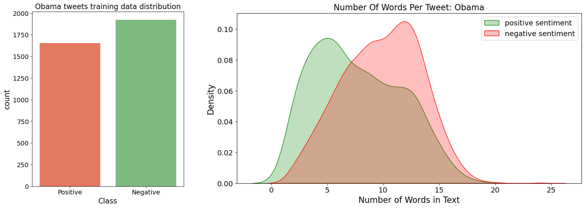
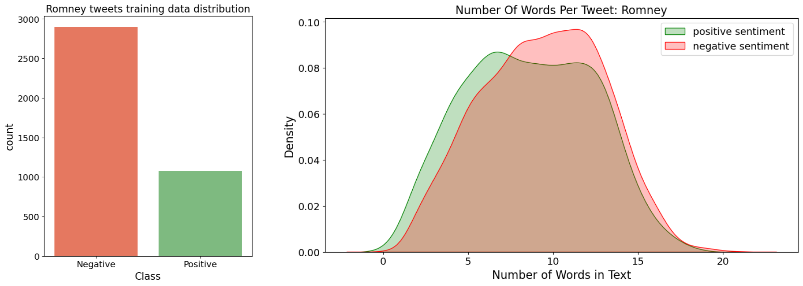
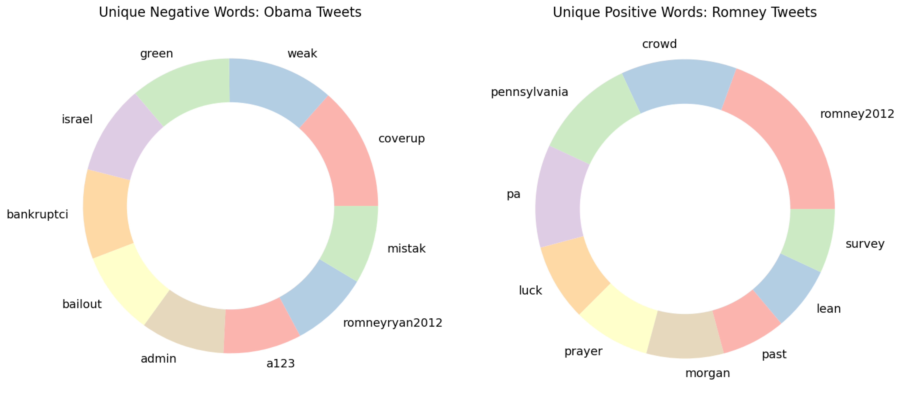

# Twitter Sentiment Analysis US 2012 Election
Classification of sentiment expressed in tweets regarding 2012 US election into **positive** and **negative** classes.

#### Exploratory Data Analysis

**Data pre-processing**: First, we clean the tweets! Lowercasing, removing URLs and usernames, punctuation and numbers.
```
def dataClean(tweets_raw):
    cleanTweets = []
    for tweet in tweets_raw:
        tweet = tweet.lower() 
        tweet = re.sub(r'\w+:\/{2}[\d\w-]+(\.[\d\w-]+)*(?:(?:\/[^\s/]*))*', '', tweet) #remove URL
        tweet = re.sub(r'(\s)@\w+', r'', tweet) 
        tweet = re.sub(r'@\w+', r'', tweet) 
        tweet = re.sub('<[^<]+?>', '', tweet) 
        # tweet = re.sub(r'[<>!#@$:.,%\?-]+', r'', tweet)
        tweet = re.sub('[^A-Za-z0-9 ]+', '', tweet)
        tweet = re.sub(" \d+", " ", tweet) 
        lower_case = tweet.lower()
        
        words = lower_case.split()
        tweet = ' '.join([w for w in words if not w in nltk.corpus.stopwords.words("english")]) #remove stopwords
        ps = nltk.stem.PorterStemmer()
        stemmedTweet = [ps.stem(word) for word in tweet.split(" ")]
        stemmedTweet = " ".join(stemmedTweet)
        tweet = str(stemmedTweet)
        tweet = tweet.replace("'", "")
        tweet = tweet.replace("\"","")
        cleanTweets.append(tweet)
        
    return cleanTweets
```

After cleaning the data, we move on to analysis. We checked the data distribution, words per tweet, and unique words in both Obama and Romney tweets. The following images are few of these highlights.







#### Data Modeling and Results
After data preprocessing and anlysis, we trained the clean data on eight machine learning algorithms for sentiment classification. We performed tests using both 80-20 train-test split and 10-fold cross validation. Furthermore, we analyzed precision, recall, F1-score and accuracy measures. The results highlight that overall **support vector machine** performed better than the other models. Model **accuracy** for sentiment classification on both obama and romney tweets are highlighted in the image below.


For more information, see the notebooks inside **Sentiment Analysis** folder.